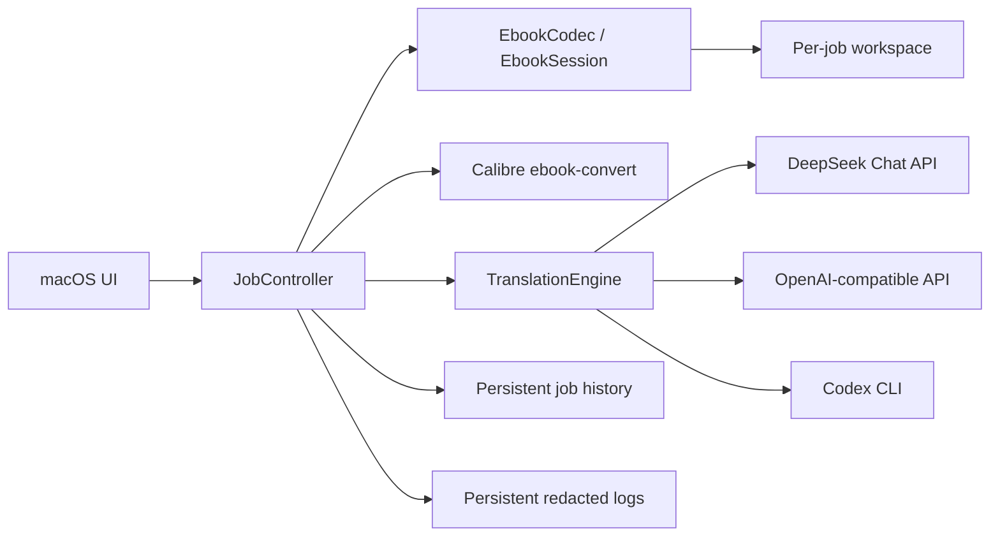

# Architecture

## Design goals

Meow separates ebook structure, translation, job orchestration, persistence,
and presentation. EPUB is the first codec, but the domain layer does not
require every ebook format to expose pages or use ZIP.

The application processes translation units incrementally. It never builds a
whole-book translation request or keeps all translated text in memory.



## Ebook codec boundary

`EbookCodec` owns format recognition, unpacking, and workspace restoration.
`EbookSession` exposes a stream of semantic `TranslationUnit` values, records
completed translations, and repacks the output.

EPUB is the canonical editable format. DRM-free MOBI and AZW3 input is
converted to an intermediate EPUB with Calibre's local `ebook-convert`
executable. The result can remain EPUB or be converted back to the source
format. Intermediate files remain in the per-job workspace and source files
are never modified.

No API assumes that an ebook has stable pages. A unit is normally a paragraph,
heading, list item, table cell, or other block-level element. The model receives
the unit's rendered source text as one plain string. Inline formatting splits
the source into stable text slots so Meow can preserve the original markup
without asking the model to reproduce it.

## EPUB fidelity model

Unpacking writes each ZIP entry to disk and records entry order, compression,
mode, OPF metadata, and XHTML resource order. The source XHTML remains
unchanged during translation.

The XHTML segmenter records:

- resource path;
- semantic block type;
- source character offsets;
- SHA-256 source hashes;
- ordered fragment identifiers.

Meow associates the plain-text response with the request's unit ID and appends
that program-generated record to `translations.jsonl`. Repacking re-segments
the original XHTML, checks every source hash, XML-escapes translated text, and
places it in the unit's first text slot while clearing the remaining source
text slots. XHTML elements and attributes therefore remain program-controlled;
the model never emits markup or identifiers. Replacements are applied from the
highest offset to the lowest so they cannot shift unapplied offsets.

For bilingual output, the repacker leaves each original XHTML block
byte-for-byte unchanged and inserts its translated clone immediately after it.
Inline markup and non-identifier attributes remain intact. The clone omits
`id` and `xml:id` attributes from its root and descendants so the document
does not contain duplicate element identifiers.

The repacker always emits `mimetype` first with no compression. Every untouched
entry is copied from its unpacked payload. OPF IDs, XHTML IDs, attributes,
links, media paths, CSS, fonts, and images are not regenerated.

This is semantic and payload fidelity, not binary ZIP identity. Compression
streams and ZIP metadata may differ after repacking, while every decompressed
untouched entry remains byte-identical.

## Translation boundary

`TranslationEngine` is the only public model boundary:

```dart
abstract interface class TranslationEngine {
  String get id;
  Stream<TranslationEvent> translate(TranslationRequest request);
  void close();
}
```

Model-specific HTTP clients are implementation details. A request contains
exactly one translation unit plus a cancellation token. An engine can emit
plain-text token deltas, a completion, a failure, or cancellation. HTTP headers
must arrive within 30 seconds, and an established stream may be idle for at
most 90 seconds. Abandoning a job cancels the active request and closes its
HTTP client.

The model receives only the unit's source text and returns only translated
text. Target language and the plain-text response contract are added to the
instructions by the engine. Unit IDs, transcript JSON, and XHTML text-slot
mapping are produced by Meow.

## Jobs and recovery

Each source file creates one `TranslationJob` with a unique workspace. Jobs
persist total, completed, and failed unit identifiers together with the
selected output mode. A successful unit is flushed to the translation
transcript and job history before the next unit starts.

```text
queued -> convertingInput -> unpacking -> translating -> repacking
  ^                                          |             |
  |                                          v             v
paused <------------------------------- pause boundary  convertingOutput
  |                                                        |
  +------------------------ resume -------------------------+-> completed

translating -> waitingForAction -> retry failed units -> queued
                         |
                         +-> retranslate all -> queued
                         |
                         +-> abandoned
```

If the app closes during work, the job is restored as `waitingForAction`.
Retrying failed units reopens the existing workspace, skips completed units,
and uses the current configuration for the same provider. Pausing cancels an
active HTTP request or Codex CLI process; conversion and repacking stop at the
next safe phase boundary. Paused jobs remain paused across launches.
Retranslate-all removes the prior transcript and workspace. Abandoning removes
the temporary workspace after in-flight work stops.

Active workspaces live in Application Support rather than the purgeable cache.
If a workspace is nevertheless missing or damaged, Meow clears all persisted
unit progress before translating again. On every restore it verifies that each
persisted completion identifier is present in the translation transcript; it
never trusts job progress without its overlay record. Completed and abandoned
workspaces are deleted. An unfinished workspace from the legacy cache location
is atomically moved, or staged and copied across filesystems, before recovery
so paid translations are not discarded during upgrade.

The append-only translation transcript is repaired before it is read. A valid
final JSON record without a newline is completed; an invalid, unterminated
tail record is truncated back to the previous newline. Malformed records that
were fully terminated still fail validation.

`abandoned` is a monotonic terminal state. Repository updates reject stale
worker snapshots that attempt to replace it, and the controller reloads the
current job after asynchronous translation and repacking operations.

The source file and output directory are stored as macOS security-scoped
bookmarks. Meow resolves and starts access only while unpacking or repacking,
then releases it. This lets a queued or retried job recover sandbox access
after relaunch. Legacy jobs without bookmarks ask the user to add the book
again.

Output names are reserved with an exclusive hidden lock. Repacking writes to a
hidden staging file on the same filesystem as the destination, while the final
`.epub` path remains absent. A complete ZIP is atomically renamed into place.
The reservation path is persisted, and its marker contains the owner job ID.
Startup may delete an interrupted final output only while that marker still
matches the recovering job. Failure and cancellation remove the marker and
immediately persist a cleared output path, so an older job can never delete a
newer job's file after the friendly name is reused. Concurrent books with the
same basename receive different numbered paths.

Remembered output paths are usable only with a matching security-scoped
bookmark. A legacy configuration without one leaves the field empty and asks
the user to choose the folder again.

## Storage

- `config.json`: last-used options, bilingual output preference, and provider
  configuration.
- `jobs.json`: provider, security-scoped bookmarks, persistent job history,
  output mode, and unit states. It never contains API keys or model
  configuration.
- `workspaces/<job-id>`: persistent in-progress source copy, unpacked entries,
  manifest, transcript, and patched XHTML. Removed at terminal completion or
  abandonment.
- `logs/<job-id>.jsonl`: persistent lifecycle log. It excludes source content
  and redacts configured API keys and bearer credentials.

Configuration and job files are written atomically with mode `0600` on macOS
and Linux. Job writes are serialized from immutable snapshots so concurrent
workers cannot share a temporary rename target. API keys are read from the
current `config.json` only when a job runs; authorization headers are never
written to job history or translation transcripts.
